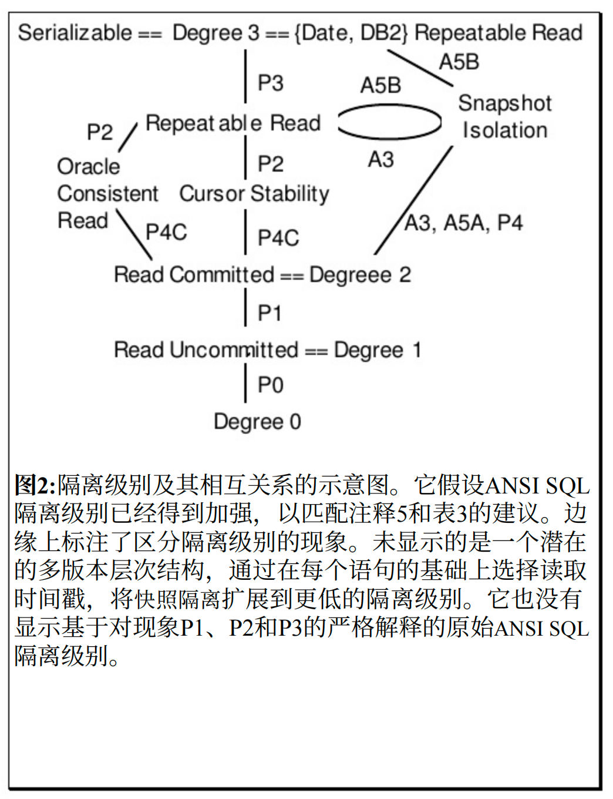
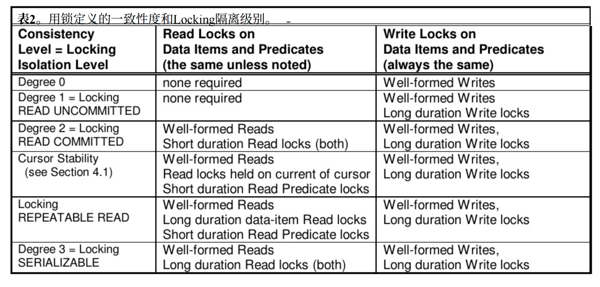

# 事务

## 隔离级别

### Degree 0

+ P0 脏写：事务2在事务1提交或回滚前修改了A，所有隔离级别都应该避免Degree 0
  
  | T1              | T2      |
  | :-------------- | ------- |
  | **Begin**       |         |
  | W(A)<-1         | Begin   |
  |                 | W(A)<-2 |
  | Commit or Abort |         |
  |                 | Commit  |

### Degree 1 Read_Uncommitted

**读不上锁，写时加锁（提交或回滚时释放）**，解决上述问题

+ A1 脏读：事务2读取了事务1未提交的修改值，之后事务1回滚，事务2提交
  
  | T1                | T2       |
  | ----------------- | -------- |
  | Begin             |          |
  | R(A)->50          |          |
  | Lock W(A)<-10     | Begin    |
  |                   | R(A)->10 |
  |                   | Commit   |
  | Abort Unlock W(A) |          |

+ P1 脏读：只要事务2读到了正在执行的事务1的写入数据 ((c1 or a1) and (c2 or a2) in any order)
  
  | T1                                | T2              |
  | --------------------------------- | --------------- |
  | Begin                             |                 |
  | R(A)->50                          |                 |
  | Lock W(A)<-10                     | Begin           |
  |                                   | R(A)->10        |
  |                                   | R(B)->50        |
  | R(B)->50                          |                 |
  | Lock W(B)<-40                     |                 |
  | Commit or Abort  Unlock W(A) W(B) | Commit or Abort |
  | Check (A+B=100)                   | Check(A+B=60)   |

### Degree2 Read_Committed

读前加锁（读完立刻释放），写时加锁

+ P4 丢失更新：事务2的修改被事务1的修改覆盖，之后事务1提交
  
  | T1                   | T2                   |
  | -------------------- | -------------------- |
  | Begin                |                      |
  | Lock R(A)            |                      |
  | R(A)->50 Unlock R(A) | Begin                |
  |                      | Lock R(A)            |
  |                      | R(A)->50 Unlock R(A) |
  |                      | Lock W(A)<-30        |
  |                      | Commit Unlock W(A)   |
  | Lock W(A)<-20        |                      |
  | Commit Unlock W(A)   |                      |
  | Check(50-20-30=20)   |                      |

+ p4c 游标丢失更新：p4的游标版本
  
  | T1                          | T2                   |
  | --------------------------- | -------------------- |
  | Begin                       |                      |
  | Lock Cursor R(A)            |                      |
  | R(A)=>50 Unlock Cursor R(A) | Begin                |
  |                             | Lock R(A)            |
  |                             | R(A)->50 Unlock R(A) |
  |                             | Lock W(A)<-30        |
  |                             | Commit Unlock W(A)   |
  | Lock Cursor W(A)<-20        |                      |
  | Commit Unlock W(A)          |                      |
  | Check(50-20-30=20)          |                      |

### Cursor Stability

避免p4c：为fetch操作增加一个读锁，一直持有到cursor移动或关闭。

+ A2 Non-Repeatable Read：事务1读x的值，事务2修改或删除x并提交，事务1再读，x已被修改或不存在
  
  | T1                   | T2                 |
  | -------------------- | ------------------ |
  | Begin                |                    |
  | Lock R(A)            |                    |
  | R(A)=>50 Unlock R(A) | Begin              |
  |                      | Lock W(A)<-30      |
  |                      | Commit Unlock W(A) |
  | Lock R(A)            |                    |
  | R(A)=>30 Unlock R(A) |                    |
  | Commit               |                    |

+ P2 Non-Repeatable Read: 只要事务2修改事务1读过的数据， ((c1 or a1) and (c2 or a2) in any order) 一律认为不可重复读

  | T1                        | T2                        |
  | ------------------------- | ------------------------- |
  | Begin                     |                           |
  | Lock R(A)->50 Unlock R(A) | Begin                     |
  |                           | Lock R(A)->50 Unlock R(A) |
  |                           | Lock W(A)<-10             |
  |                           | Lock R(B)->50 Unlock R(B) |
  |                           | Lock W(B)<-90             |
  |                           | Commit Unlock W(A) W(B)   |
  | Lock R(B)->90 Unlock R(B) | Check (A+B=100)           |
  | Commit                    |                           |
  | Check (A+B!=100)          |                           |

  

### Repeatable Read

读单个数据加上long duration read lock，读一组数据加上short duration read lock

+ A3 Phantom：和A2相似，区别在于是针对一组数据，而不是单个数据

  | T1                          | T2                           |
  | --------------------------- | ---------------------------- |
  | Begin                       |                              |
  | Lock R(P) (P是一个过滤条件) |                              |
  | R(P)->list1 Unlock R(P)     | Begin                        |
  |                             | Lock R(A)->10                |
  |                             | Lock W(A)<-30,(30 满足条件P) |
  |                             | Commit Unlock R(A) W(A)      |
  | Lock R(P)                   |                              |
  | R(P)->list2 Unlock R(P)     |                              |
  | Commit                      |                              |

+ P3 Phantom：和A3相似，区别在于不论事务1、2是提交还是回滚

  | T1                      | T2                        |
  | ----------------------- | ------------------------- |
  | Begin                   |                           |
  | Lock R(P)               |                           |
  | R(P)->list1 Unlock R(P) | Begin                     |
  |                         | Lock R(A)->10             |
  |                         | Lock W(A)<-30             |
  |                         | Commit or Abort R(A) W(A) |
  | Lock R(P)               |                           |
  | R(P)->list2 Unlock R(P) |                           |
  | Commit or Abort         |                           |

### Degree 3 Serializable

读时加long duration read lock,写时加long duration write lock

### MVCC Snapshot

> + 每个值在写的时候都会分配一个新的版本号(Version)
> + 每个事务开始的时间点记为Start Timestamp
> + 每个事务提交时获取一个Commit Timestamp（大于任何现有的StartTs CommitTs）

+ 约束1: if other.CommitTs<self.StartTs {self can Read(other.data)}

  > 每个事务只能读到(other.CommitTs<self.StartTs)的其他事务的数据版本。
  >
  > 此特性可以避免A1,P1(脏读),A2,P2(不可重复读)

+ 约束2：First-Committer-Wins：

  if self.StartTs<=other.CommitTs<=self.CommitTs and self.Write==other.Write {

  ​	self should Abort

  }

  > 如果有其他事务在这个事务的[StartTs,CommitTs]时间区间内，且修改了和这个事务同样的数据，那么这个事务应该回滚。  
  >
  > 此特性可以避免P0(脏写)和P4(丢失更新)

+ 快照隔离级别强于Degree 0,Degree 1(Read_Uncommitted,Read_Committed,Cursor Stability)，弱于Degree 3(Serializable)

  | T1                    | T2       |
  | --------------------- | -------- |
  | Begin                 |          |
  | R(A)->50              |          |
  | R(B)->50              | Begin    |
  |                       | R(A)->50 |
  |                       | R(B)->50 |
  | W(B)<-10              | W(A)<-10 |
  | Commit                | Commit   |
  | Check(A+B==20 != 100) |          |

  A5b(Write Skew) 符合MVCC的约束，都能执行成功，但却违反了A+B==100的约束，故弱于Degree 3

+ 快照隔离级别无法与Repeatable Read比较

  A5(Data Item Constraint Violation):打破了两个数据A和B的一个约束条件

  + A5a(Read  Skew)

    | T1                  | T2       |
    | ------------------- | -------- |
    | Begin               |          |
    | R(A)->50            | Beign    |
    |                     | W(A)<-10 |
    |                     | W(B)<-90 |
    |                     | Commit   |
    | R(B)->90            |          |
    | Commit or Abort     |          |
    | Check(50+90 != 100) |          |

  + A5b(Write Skew)

    | T1                | T2                |
    | ----------------- | ----------------- |
    | Begin             |                   |
    | R(A)->50,R(B)->50 | Begin             |
    |                   | R(A)->50,R(B)->50 |
    | W(B)<-10          | W(A)<-10          |
    | Commit            | Commit            |
    | Check(A+B != 100) |                   |

  > + Snapshot不能避免A5b，但Repeatable Read能避免P2(修改正在执行的其他事务读过的数据)，则一定能避免A5a,A5b
  > + Snapshot能够避免A3(Snapshot可以看到的是数据库的快照而不是单个数据的快照)，但Repeatable Read不能避免A3

+ 快照隔离级别无法完全避免P3

  | T1                                  | T2                  |
  | ----------------------------------- | ------------------- |
  | Begin                               |                     |
  | R(P)->listA                         | Beign               |
  | Check(sum(listA)<8) (sum(listA)==7) | R(P)->listA         |
  |                                     | Check(sum(listA)<8) |
  | W(a)<-1 (a in P)                    | w(b)<-1 (b in P)    |
  | Commit                              | Commit              |
  | Check(sum(listA)==9 > 8)            |                     |

  **First-Committer-Wins**仅限于单个数据，符合Snapshot约束，将多版本转换为单版本事务历史，符合P3现象，故无法完全避免P3

  由于Snapshot级别下，每个事务无法看到并发事务的更新，故可以避免A3

+ 如果赋予一个事务非常久远的时间戳，则此事务不可能被阻塞或写入阻塞，但不可更新刚被其他事务更新的数据项。

+ 快照隔离在乐观并发中对只读事务有明显优势，但不适用于长时间更新事务与高争用的短事务的竞争（长时间更新会因为约束2**First-Committer-Wins**而被丢弃）

### Oracle Read Consistency

+ 只有提交才能对其他事务可见，但这也导致正在并行的事务可以读取刚提交的修改。故能避免A1,P1(脏读)，但不能避免P2(不可重复读),A5a

+ 不实现**First-Committer-Wins**而是而是通过写入锁实现**First-Writer-Wins**，所以不能避免P4丢失更新
+ 在Read Consistency隔离级别下，是为每个sql语句开始时分配开始时间戳，并提供数据库最新的更新值
+ 游标集的时间是Open Cursor的时间，禁止P4C游标丢失更新

### 总结

